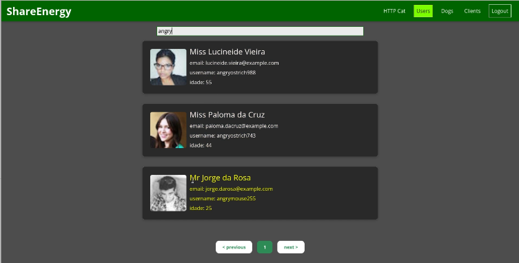
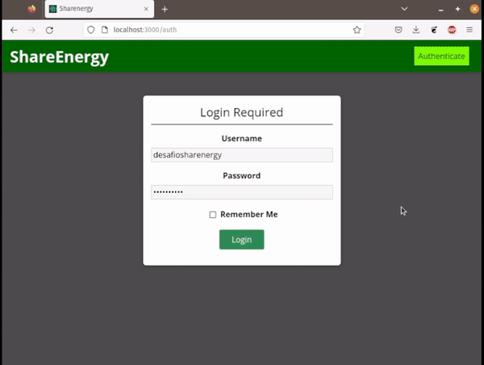
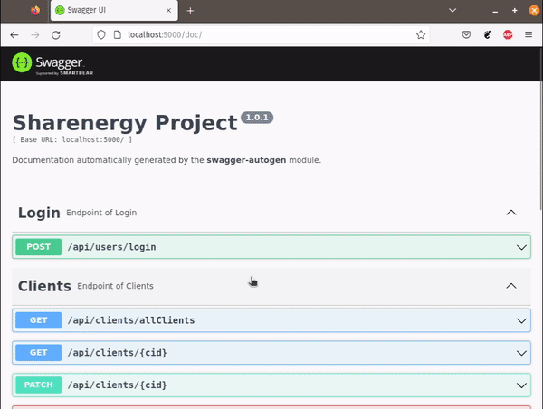

# Desafio para o processo seletivo SHARENERGY 2023/01

Repositório destinado a criação de uma aplicação Web, integrada com APIs como [Random User Generator](https://randomuser.me/), [HTTP Cat](https://http.cat/) e [Random Dog](https://random.dog/).

# O Desafio

Construir uma aplicação web (frontend e backend) capaz de realizar a comunicação com APIs distintas, além de um CRUD. A descrição completa está no link: [Descricao](https://github.com/eversonm/desafio-sharenergy-2023-01/blob/main/README.md).

## Aplicação hospedada
<b>https://sharenergy-app.onrender.com</b>

## Vídeo da Aplicação

### Requisitos da aplicação e de código

- Interface amigável, bonita e limpa
- Responsividade
- Clean Code

### Ferramentas Utilizadas

- ReactJS
- NodeJS
- MongoDB
- ~~Typescript~~
- HTML e CSS

## Adicionais
- Docker e Docker-compose
- Swagger Docs

## Executar a aplicação
A aplicação foi desenvolvida para ser executada em docker, evitando configurações extras. Assim, o usuário só precisa ter o [Docker](https://docs.docker.com/desktop/) e [Docker Compose](https://docs.docker.com/compose/gettingstarted/) instalado em sua máquina.

## Iniciar a aplicação localmente (via terminal)
<pre><code>docker compose up</code></pre>

## Links para descrição mais detalhada do front e back:
+ [Front-end](https://github.com/eversonm/desafio-sharenergy-2023-01/tree/everson-magalhaes-cavalcante/front-end)
+ [Back-end](https://github.com/eversonm/desafio-sharenergy-2023-01/tree/everson-magalhaes-cavalcante/back-end)

## Front-end

## Back-end

